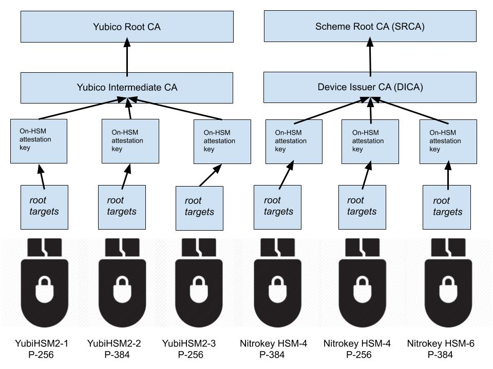
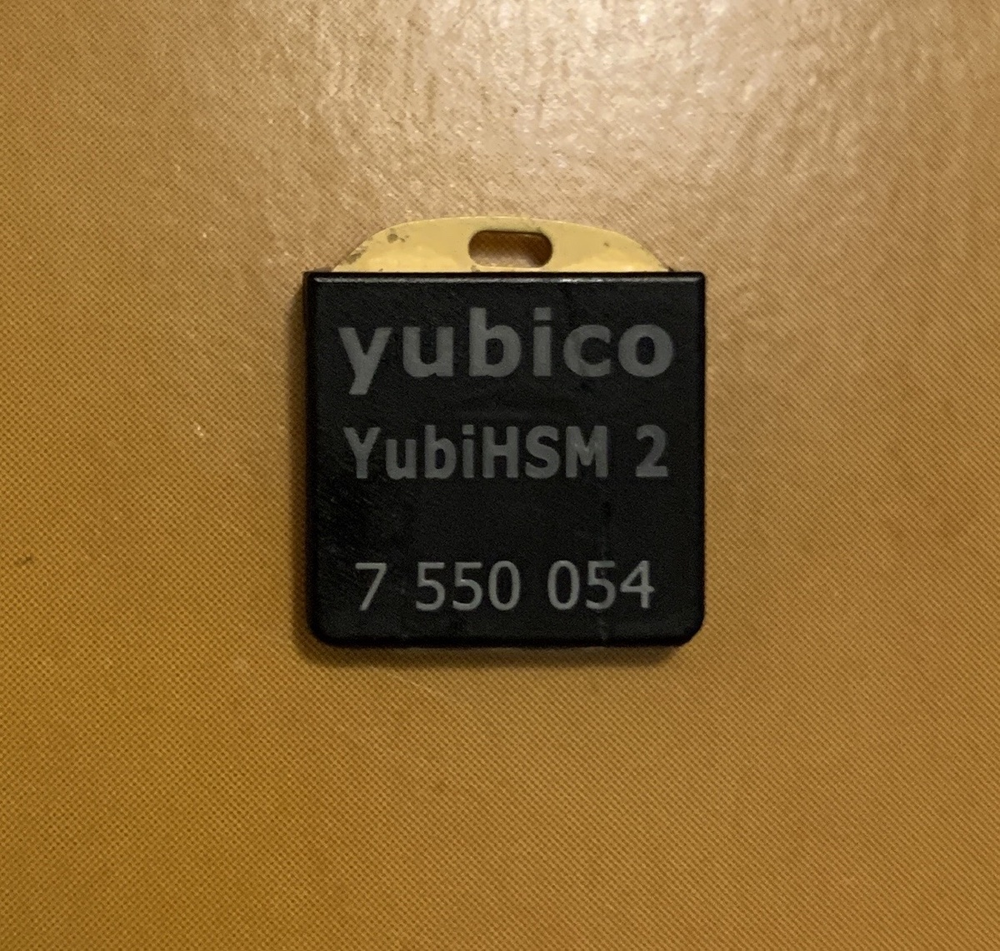

psf-tuf-runbook
===============

This repository contains a runbook and supporting program for the Python Software Foundation's
TUF key generation and signing ceremonies.

## Notation

This document is designed to be read as a *runbook* -- a collection of discrete instructions
with remediation steps that, if followed correctly, should result in the intended effects.

We use the following notation:

* **DO** *actions*: Perform the following actions.
* **IF** *condition* **THEN** *actions*: If *condition* is met, then perform the following *actions*.
* **GO TO** *heading*: Go to the referenced heading in the runbook and perform the stated actions
thereon. Do **not** return to the previous section unless told to.
* **END**: You've reached an end state.

1. **DO GO TO** [Start](#start)

## Start

1. **DO GO TO** [Prepare the environment](#prepare-the-environment).

## Prepare the environment

1. **DO** have the following equipment ready:

    * The trusted offline computer
    * A camera or phone capable of taking pictures
    * A USB drive or other removable flash storage labeled "PUBLIC" and formatted as FAT32
    * The HSM being provisioned, in tamper-evident packaging
    * New tamper-evident bags for storing the HSM and flash storage
    * A permanent marker pen
    * A pair of scissors

1. **IF** you have a phone or other personal devices, **THEN** set them on airplane mode.

1. **DO** take pictures of the following:

    * The HSM, in its tamper-evident packaging

1. **DO** remove the HSM from its packaging.

<!-- 1. **DO** clone this repository:

```bash
$ git clone https://github.com/trailofbits/psf-tuf-runbook
``` -->

1. **DO GO TO** [Determining the HSM](#determining-the-hsm)

## Determining the HSM

1. **IF** you have a YubiHSM 2 that either has *not* been provisioned in a previous ceremony *or*
needs to be reprovisioned due to compromise,
**THEN GO TO** [Provisioning the YubiHSM 2](#provisioning-the-yubihsm-2).

1. **IF** you have a YubiHSM 2 that has already been provisioned in a previous ceremony,
**THEN GO TO** [Signing with the YubiHSM 2](#signing-with-the-yubihsm-2).

1. **IF** you have a Nitrokey HSM that either has *not* been provisioned in a previous ceremony *or*
needs to be reprovisioned due to compromise,
**THEN GO TO** [Provisioning the Nitrokey HSM](#provisioning-the-nitrokey-hsm).

1. **IF** you have a Nitrokey HSM that has already been provisioned in a previous ceremony,
**THEN GO TO** [Signing with the Nitrokey HSM](#signing-with-the-nitrokey-hsm).

1. **IF** you did not go to a header above, **THEN** you have an unsupported HSM.

1. **END**

## Provisioning the YubiHSM 2

1. **DO** determine your signing body ID. You were given this ID with your HSM.

    Your signing body ID looks like "${HSM}-${Number}". For example:

    * `YubiHSM2-1`
    * `Nitrokey HSM-4`

1. **DO** determine your key type, using your signing body ID and the attestation chart below:

    

    For example, if your signing body ID is `YubiHSM2-2`, then your key type is P-384.

1. **DO** locate and write down the serial number printed on the YubiHSM 2. Refer to the picture below:

    

    In this picture, the serial number is `7550054`. Note that in later steps the serial number will
    be 0-padded to 10 digits, like `0007550054`.

1. **DO** confirm the hash of the `./bin/yubihsm-provision` binary against the following checksums with
the following commands:

    * SHA1: **TODO**
    * SHA2-256: **TODO**

    ```bash
    $ shasum -a 1 ./bin/yubihsm-provision
    $ shasum -a 256 ./bin/yubihsm-provision
    ```

1. **IF** the YubiHSM 2 is being reprovisioned due to a compromise or failed ceremony, **THEN** you
must perform a physical reset.

    1. **DO** touch and hold the metal contact of the YubiHSM 2 for ten (10) seconds as you insert
    it into the trusted offline computer.

1. **IF** the YubiHSM 2 is being provisioned for the first time, **THEN** insert it into the trusted
offline computer.

1. **DO** ensure that exactly 1 (one) YubiHSM 2 is inserted into the trusted offline computer.

1. **DO** run the `yubihsm-provision` binary, using your key type according to the following rules:

    * **IF** your keytype is "P-256", **THEN** pass `--type p256`
    * **IF** your keytype is "P-384", **THEN** pass `--type p384`

    ```bash
    $ ./yubihsm-provision --type KEYTYPE
    ```

1. **DO** wait for this prompt:

    ```
    !!!!!!!!!!!!!!!!!!!!!!!!!!!!!!!!!!!!!!!!!!!!!!!!!!!!!
    !!!                    DANGER!                    !!!
    !!!                                               !!!
    !!!   This program will reset and reprovision     !!!
    !!!   your YubiHSM 2 for TUF purposes.            !!!
    !!!                                               !!!
    !!!   Make sure to read the runbook before        !!!
    !!!   using this program. Failure to do so        !!!
    !!!   will cause PERMANENT key loss.              !!!
    !!!                                               !!!
    !!!   Hit "y" (case insensitive) to continue.     !!!
    !!!                                               !!!
    !!!!!!!!!!!!!!!!!!!!!!!!!!!!!!!!!!!!!!!!!!!!!!!!!!!!!
    ```

1. **DO** hit `y` once ready to continue.

<!-- 1. **IF** you see the either of the following error outputs:

    ```
    Fatal: Attestation file already exists: root_attestation.der; aborting
    ```

    or:

    ```
    Fatal: Attestation file already exists: targets_attestation.der; aborting
    ```

    **THEN** you have intermediate files left over from a previous provisioning.  -->

1. **DO** wait for the following output and prompt:

    ```
    Discovered a Yubico YubiHSM with serial number XXXXXXXXXX
    We've successfully authenticated with the HSM!
    Continue with factory reset? This step is IRREVERSIBLE! [y/N]
    ```

1. **DO** confirm that the serial number in the output matches the serial number written down.

1. **DO** hit `y` once ready to continue.


1. **DO** wait for the following output and prompt:

```
Success! Giving the HSM 10 seconds to come back online...

#####################################################
###                                               ###
###   We're going to create a new "auth key"      ###
###   on your YubiHSM.                            ###
###                                               ###
###   This "auth key" will                        ###
###   have a password that you MUST remember      ###
###   OR store securely and will protect the      ###
###   TUF keys that are going to be created.      ###
###                                               ###
###   Hit "y" (case insensitive) to continue.     ###
###                                               ###
#####################################################
```

1. **DO** hit `y` once ready to continue.

1. **DO** enter your new authentication key password. This password should be long, random, and
unique.

1. **DO** re-enter your authentication key password.

1. **DO** wait for the following output:

    ```
    Success! Provisioned a new authentication key as object 2 and deleted the default key
    Success!
    We're creating our TUF keys and attestation certificates now.
    ```

1. **DO** re-enter your authentication key password.

1. **DO** wait for the program to exist.

1. **DO** check for the following files in the runbook directory:

    ```
    XXXXXXXXXX_cert.der
    XXXXXXXXXX_root_attestation.der
    XXXXXXXXXX_root_pubkey.pub
    XXXXXXXXXX_targets_attestation.der
    XXXXXXXXXX_targets_pubkey.pub
    ```

    Where `XXXXXXXXXX` is the 0-prefixed serial number.
